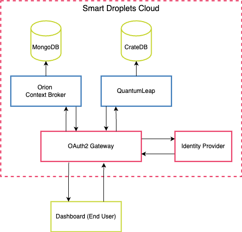

# SmartDroplets Kubernetes Deployment

This project contains Kubernetes configuration files for deploying SmartDroplets components to a Kubernetes cluster.

## Project Structure

There are currently 6 cloud components in the SD cloud. Their _deployment_ and _service_ configurations are stored separately, based on the components, within subdirectories of the _k8s/_ directory.

```
.
├── README.md
├── k8s
│   ├── cratedb/
│   ├── dashboard/
│   ├── digitaltwin/
│   ├── orion/
│   ├── mongo/
│   └── quantumleap/
└── manage.sh
```

## Architecture


The system follows a cloud-edge architecture where data acquisition and processing are managed through an interconnected set of components. The core of the architecture is the Orion Context Broker, which facilitates communication between field edge devices, databases, analytics tools, and the Digital Twin Simulator.

### Key Components and Their Roles

#### 1. SD Edge Devices

These are the field-deployed IoT devices responsible for collecting real-time agricultural data, mounted on retrofitted tractors which autonomously traverse the field. 
They send data to the Orion Context Broker following the upstream flow (1).
Devices also receive command messages and simulation results through the downstream flow (2).

#### 2. Orion Context Broker

Acts as the central message hub for managing contextual information.
It receives sensor data (upstream flow 1) from edge devices and stores it in MongoDB for persistent storage.
It interacts with the Digital Twin Simulator to perform real-time crop state simulations and send back actionable insights.

#### 3. Digital Twin Simulator

Runs daily simulations analyzing crop conditions and forecasting optimal farming actions.
Uses collected sensor data and third-party weather inputs for accurate modeling.
Results from the simulations are pushed downstream (2) to edge devices and users.

#### 4. MongoDB & CrateDB

MongoDB stores structured data from Orion Context Broker, providing persistent access to real-time and historical sensor readings.
CrateDB is used for time-series data analysis and integrates with QuantumLeap for visualization and monitoring.

#### 5. QuantumLeap

QuantumLeap subscribes to updates from the Orion Context Broker, and stores time-series data from in CrateDB for advanced analysis. Using this API, the dashboard provides analytical data through charts.

#### 6. SD Dashboard

The SD Dashboard provides a graphical interface for farmers and stakeholders to view analytics, monitor field conditions, and trigger manual simulation runs.


### Data Flows

The Smart Droplets solution follows two main data flows:

1. Upstream Flow (Data Acquisition)

- Autonomous field systems collect real-time data at the edge.
- Third-party weather data is integrated to enhance the accuracy of Digital Twin (DT) simulations.
- Farmers can manually input field operation data or import legacy data for specific crops and fields.

2. Downstream Flow (Simulation & Recommendations)

- The DT simulator runs daily, analyzing crop conditions and generating predictions to optimize yield and minimize pesticide use.
- Farmers can also trigger manual simulations by entering additional data.
- Simulation results, along with actionable recommendations, are communicated to users and edge devices.
- These data flows ensure seamless integration between real-time field data, external sources, and predictive simulations, enabling informed decision-making.


## Component Descriptions

### Orion Context Broker

The Orion Context Broker is an implementation of the NGSI-LD API that allows you to manage the entire lifecycle of context information including updates, queries, registrations, and subscriptions. It is a core component of the FIWARE platform that enables the management of context information in a highly decentralized and large-scale manner.

Key features:
- NGSI-LD compliant API
- Real-time updates and notifications
- Query and subscription capabilities
- JSON-LD data format support

### CrateDB
CrateDB is a distributed SQL database built on top of a NoSQL foundation. It combines the familiarity of SQL with the scalability and data flexibility of NoSQL. In this architecture, it serves as the time-series database backend for QuantumLeap.

Key features:
- Distributed SQL database
- Real-time analytics
- Time-series data optimization
- Horizontal scalability

### MongoDB
MongoDB is used as the primary database for the Orion Context Broker. It stores all context data and subscription information managed by Orion.

Key features:
- Document-oriented database
- High performance
- High availability
- Automatic scaling

### QuantumLeap
QuantumLeap is a REST service for storing, querying, and retrieving NGSI v2 and NGSI-LD spatial-temporal data. It acts as a connector between Orion Context Broker and time-series databases (in this case, CrateDB).

Key features:
- Time-series data storage
- Geospatial queries
- Multi-tenancy support
- Integration with various time-series databases


## Deployment

To deploy the components to your Kubernetes cluster, use the _manage.sh_ script provided in the repository:

```bash
./manage.sh start
```

Alternatively, you can spin up all of the pods manually using kubectl like so:

```bash
kubectl apply -f k8s/
```

This will apply all the Kubernetes configuration files in the k8s/ directory and its subdirectories.

To stop all of the components, you can run the same _manage.sh_ script with the "stop" argument:

```bash
./manage.sh stop
```

### NOTE: Local development

When running the cluster locally, if using _minikube_, a tunnel must be opened to allow access to the SD Dashboard. This can be done via _minikube_ using the following command:

```bash
minikube tunnel
```

## Security Mechanisms



The Smart Droplets data platform is secured through OAuth2, employing an OAuth2 gateway in front of the protected API routes. An identity provider manages user authenticaiton and authorization. Endpoints are protected through an OAuth2 proxy.

## Configuration

Each component may have specific configuration options. Refer to the individual YAML files for detailed configuration settings.

## Prerequisites

* Kubernetes cluster

* kubectl configured to communicate with your cluster

* Required images pulled and accessible to your cluster

## Monitoring and Logging

Refer to your Kubernetes cluster's monitoring and logging solutions for observing the deployed components.

